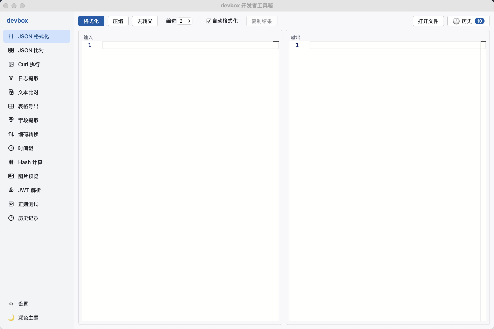
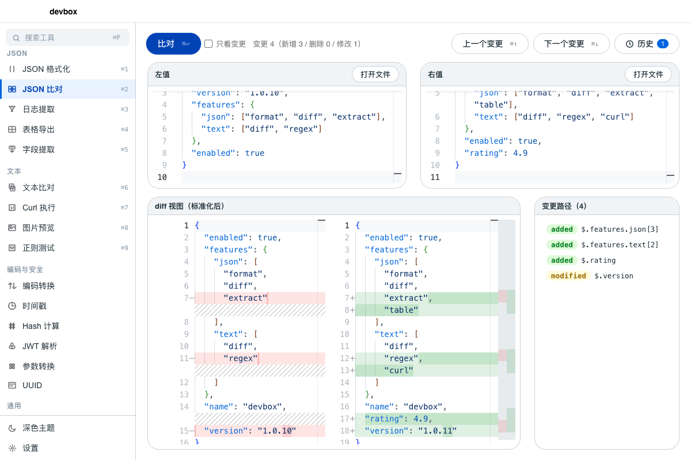
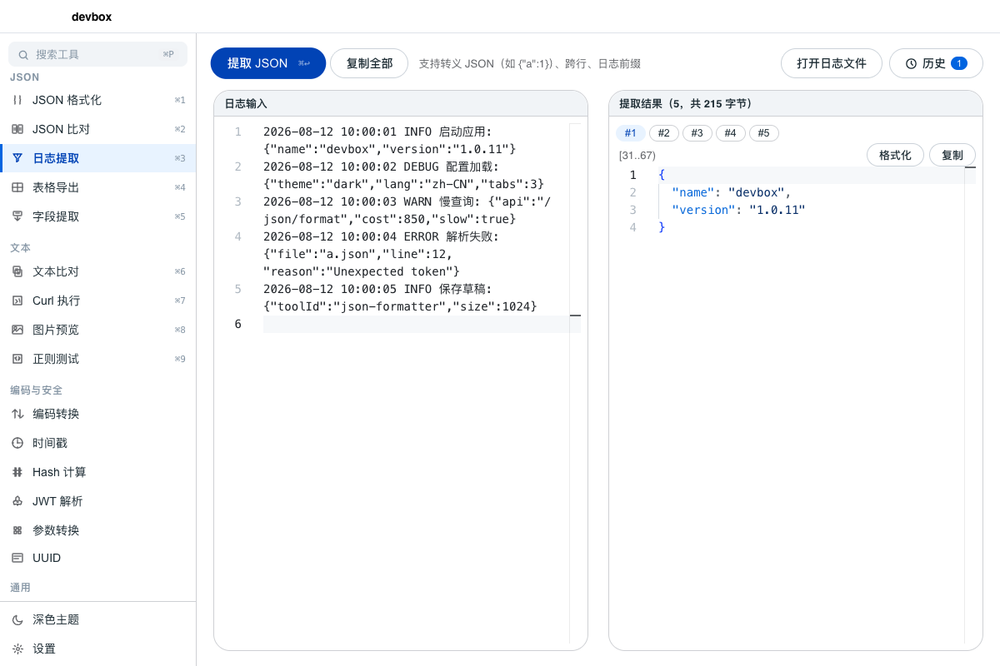

# devbox 开发者工具箱


一款面向开发者的桌面工具箱应用，解决日常开发中高频的 JSON 处理、文本比对、日志分析、调试辅助等需求。基于 Tauri 2 + React + TypeScript，macOS 原生体验，体积小、启动快。界面采用 Meta (Store) 风格的「代码前向」设计——发丝边框、高信息密度、默认浅色。

> 同一份前端代码可构建为纯静态网页版部署到 GitHub Pages（见下方「网页版」），桌面端走 Rust 后端，网页端走 JS 降级实现，详见 `src/utils/backend.ts`。

## 功能一览

### JSON 系列
- **JSON 格式化** — 美化（缩进 2/4 可切换）/ 压缩 / 反转义，解析失败精确定位行列；多标签同时打开多份 JSON（内容跨重启持久化）；自动格式化、悬停预览 JSON 值、点击 key 弹层复制、输出一键折叠/展开
- **JSON 比对** — 递归按 key 比对，识别新增/删除/值修改，两侧输入即实时自动比对（⌘↩ 兜底），「只看变更」折叠未变更区域，变更路径按 path 精确定位 + ⌘↑/⌘↓ 变更导航
- **日志提取** — 从混排日志中提取转义 JSON（`"{\"a\":1}"`），支持跨行与日志前缀，命中列表可格式化/复制
- **表格导出** — 数据源三态选择（自动/整个 JSON/数组路径），字段多选 + 列顺序拖拽，预览分页，数组折叠为换行单元格，导出 CSV / JSONL（系统对话框选路径，含公式注入防护）
- **字段提取** — 按 JSON 路径提取字段，嵌套 key 用 `.` 连接

### 文本与调试
- **文本比对** — 左右并排 / 上下堆叠 / 仅对比变更三种布局，行级高亮 + 变更统计，⌘↑/⌘↓ 切换变更块
- **Curl 执行** — 粘贴 curl 脚本直接执行，展示状态码/响应头/响应体（JSON 自动格式化高亮）
- **正则测试** — 语法高亮命中、捕获组展开、实时匹配计数
- **图片预览** — 快速查看图片文件
- **Cron 生成器** — 输入 Cron 表达式计算最近 5 次执行时间，内置 22 条常用表达式，一键复制

### 编码与安全
- **编码转换** — Base64 编解码、URL 编解码、大小写转换（UTF-8 安全）
- **参数转换** — URL 参数 / JSON / 查询串互转
- **时间戳** — 秒/毫秒 ↔ 日期互转，本地/UTC 时区
- **Hash 计算** — MD5、SHA-1、SHA-256/384/512，支持文本与文件
- **UUID 生成** — 一键随机生成 4 种格式（小写/大写 × 带/无连字符），批量化复制
- **JWT 解析** — 解码 header/payload，展示过期状态与剩余时间
- **RSA 加密** — 生成 512/1024/2048 位密钥对（SPKI/PKCS#8 Base64），RSA / PKCS1 / OAEP 三种填充，公私钥双向加解密

### 通用能力
- **历史记录** — 所有工具的操作历史，可一键加载重放
- 文件拖拽导入、全局快捷键（`Cmd+1..9` 切换工具、`Cmd+Enter` 执行、`Cmd+Shift+C` 复制）、命令面板（`Cmd+P`）、深浅主题切换、工具启停排序、分组折叠、工具收藏（常用分组置顶）

## 界面截图







## 技术栈

| 层 | 选型 |
|-----|------|
| 桌面框架 | Tauri 2.x（Rust 后端 + Web 前端） |
| 前端 | React 19 + TypeScript + Vite |
| 编辑器/Diff | Monaco（`@monaco-editor/react`，本地打包无 CDN） |
| 状态管理 | zustand |
| JSON 核心逻辑 | Rust + serde_json（前端 invoke 调用，异步不阻塞 UI） |

## 环境要求

- macOS（Apple Silicon 或 Intel）
- Rust 1.97+、Node 22+、Xcode Command Line Tools

## 开发与构建

```bash
# 安装依赖
pnpm install

# 开发模式（热重载）
pnpm tauri dev

# 生产构建（产出 .app，自动清理旧 dist 重新打包）
pnpm tauri build

# 类型检查（会先清理 dist 再重新构建）
pnpm build
```

构建产物位于 `src-tauri/target/release/bundle/macos/devbox.app`。

## 网页版（GitHub Pages）

同一套前端代码可零服务端部署到 GitHub Pages：`pnpm build` 产出的 `dist/` 即静态站点。

- **桌面端**：Tauri 环境检测到 `window.__TAURI_INTERNALS__`，JSON 格式化/比对/提取/表格导出走 Rust 命令（`invoke`），curl 调用系统二进制
- **网页端**：4 个 JSON 命令在浏览器内用 JS 降级实现（与 Rust 返回结构逐字段对齐，对象键按字母序排序以匹配 `serde_json` 默认 BTreeMap 行为）；表格导出改为 `Blob` + `<a download>`；curl 因需调用系统二进制且受 CORS 限制，网页版禁用并提示「请使用桌面版」
- **部署**：push 到 `main` 触发 `.github/workflows/pages.yml` 自动构建发布；仓库 Settings → Pages → Source 选「GitHub Actions」即可

> 其余工具（时间戳/Hash/JWT/UUID/RSA/编码转换/正则测试/参数转换/图片预览/文本比对/字段提取/历史记录）纯前端实现，桌面与网页行为完全一致。

## 下载

访问 [Releases](https://github.com/Jensen077/dev-tools/releases) 下载最新版本。

> 注：当前为未签名/未公证构建，macOS 首次打开需右键选择"打开"，或到 系统设置 → 隐私与安全性 中允许。
